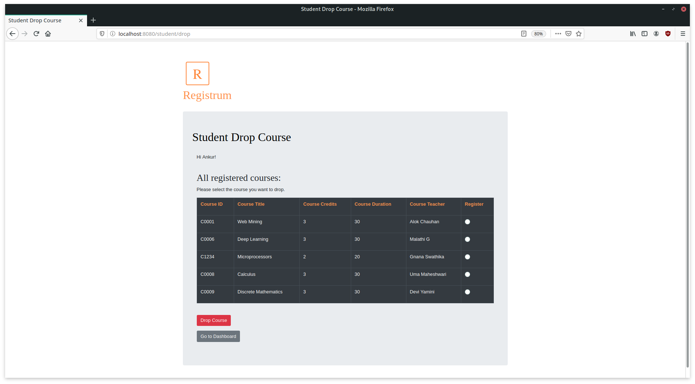

# PayPal VAP Mid Term Project
## E-learning portal "Registrum"

### Running the project
1. Clone the repository.
2. Enter midTermProject/app/routes
```
cd midTermProject/app/routes
```

3. Install all packages by running this command
```
npm install
```
4. Execute the project by running
```
npx nodemon appRoutes.js
```
Alternatively you can run
```
node appRoutes.js
```

5. Open your browser and access
http://localhost:8080/

### About
Registrium is an E-learning portal with the following functionalities:

- Teacher 
    - Sign Up (with a check for unique teacher ID)
    - Log In (session is maintained)
    - Teacher Dashboard
        - View courses created by that teacher
        - View students who have registered for all courses created by that teacher
    - Create new courses (with a check for unique course ID)
    - Remove courses created by that teacher
    - Logout

- Student
    - Sign Up (with a check for unique student ID)
    - Log In (session is maintained)
    - Student Dashboard
        - View details of courses registered by that student
        - View total number of credits registered by that student
    - Register Courses (displays a table with details of all unregistered courses and the option to register)
    - Drop registered courses

### Run Through
This project has previously registered teachers, students and courses in the userData folder, for facilitating instant review of all functionalities.

To reset all data (optional), go to the app folder on your terminal and run config.js using the command
```
node config.js
```
The following steps are recommended to view the functionalities in the best manner:

1. Sign Up for a teacher.
2. Log in. 
3. Create a few new courses.
4. You can now see these courses on the dashboard, and also **remove these courses**.
5. Sign Up for a student.
6. Log In.
7. Register for some courses.
8. Now you can see these courses on the dashboard, along with the total number of registered credits.
9. Drop any course.
10. Log In as a teacher to view the registered students for every course.


#### Home Page


This page is the home page. All undefined routes are redirected to the home page. Both teachers and students can sign up and log in from **home**.

#### Teacher Sign Up 

If the teacher ID is unique (not previously registered), then the status is displayed accordingly.

Otherwise:


#### Teacher Log In

Authentication status is shown after logging in.

Successful authentication:

Unsuccessful authentication:


#### Teacher Dashboard
If authentication is successful, you can view the dashboard.

You can view all the courses created by you.

You can click on any of the "View Registered Students" buttons to view the students who have registered for a particular course.

There are options to create a course and remove a course at the bottom of the dashboard.


**Preview of dashboard, viewing registered students, and remove course:**


Preview of create course:


A status page is displayed to show the final course element that is added to the file. Some elements are auto added, such as teacher ID, Name, date of course creation.


#### Student Sign Up and Login
Student section has similar pages for Sign Up, Sign Up status, Log In, and Authentication status.

#### Student Dashboard, Register Courses and Drop Courses

This shows a table of all the registered courses with relevant details.
It also shows the total number of credits registered.


The 'Register Course' button can be used to view details of unregistered courses and register a course.


The 'Drop Course' button can be used to view details of registered courses and drop a course.



### Code and Concepts Used

Project structure:
1. routes has all the routes and assets.
2. services has functions that are exported to be used in routes.
3. userData has the data files.
4. views has the PUG files for all pages.


This project has been created using JavaScript, NodeJS and PUG/html.

Concepts Used:
1. All services are exported using module.exports.
2. Async/await concepts have been used to make file reads fail-safe.
```js
var fs = require('fs');

async function jsonAppendCourse(new_element){
    filename='../userData/courses.json'
    type='utf8'
    await fs.readFile(filename, type, function readFileCallback(err, data) {
        if (err) {
            console.log(err);
        } else {
            obj = JSON.parse(data); //converting read data to object
            obj.courses.push(new_element); //pushing new data to the array 'courses' in object
            json = JSON.stringify(obj); //converting it back to json
            fs.writeFile(filename, json, type, function (err){
                if(err) throw err;
            }); // writing it back 
        }
    })
}
module.exports = jsonAppendCourse;
```
3. Promises have been implemented for predictable behaviour of routes.
```js
// Student Drop Course
app.post('/student/drop', function (req, res) {
    if (!req.session.user) {
        auth = false;
        res.render('studentDrop', {
            authenticated: auth
        })
    }
    else {
        auth = true;
        var courses;
        const promiseCourse = readFile('../userData/courses.json', 'utf-8');
        promiseCourse
            .then((data) => {
                var allcourses = JSON.parse(data).courses;
                courses = allcourses;
            })
            .then(() => {
                studentObject = req.session.user;
                return studentObject
            })
            .then((studentObject) => {
                res.render('studentDrop', {
                    data: studentObject,
                    authenticated: auth,
                    courseList: courses
                })
            })
            .catch((err) => console.log(err))
    }
})
```
4. Lodash has been used for authentication, dropping courses (students), removing courses (teachers).
```js
if (!(_.find(allStudents, { 'id': submittedID, 'password': submittedPassword }) == undefined)) {             
    auth = true;
}
```
```js
if (obj["courses"][i].id == submittedID) {
    _.remove(obj["courses"][i].students_registered, (e) => { 
        return e == studentID;
    }
```
5. Session is maintained for logged in user.
```js
var session = require('express-session');
.then((allStudents) => {
            if (!(_.find(allStudents, { 'id': submittedID, 'password': submittedPassword }) == undefined)) {             //using Lodash to check authenticate ID with password
                auth = true;
                studentObject = _.find(allStudents, { 'id': submittedID });// getting object from data file 
                req.session.user = studentObject;
                return studentObject
            }
        })
```
```js
//Log Out/ Sign Out (destroys the session)
app.post('/signout', function (req, res) {
    if (req.session) {
        req.session.destroy();
        res.redirect('/home');
    }
})
```

6. util.promisify has been used to wrap fs.readFile in a promise. This has been used for all file reads in the routes file.

```js
const fs = require('fs');
const util = require('util')
const readFile = util.promisify(fs.readFile);

function readFil(filename, type){
    const promise = readFile(filename,type);
    return promise;
}

module.exports = readFil;
```
7. File Handling has been done through fs.readFile as well as custom promise as mentioned in point 6. Manipulations have been done using JSON.parse.

8. Callbacks
9. Middleware
```js
app.use(session({ secret: "yfgab182736bhb0sfa", resave: false, saveUninitialized: true }));

```

### Clone the repo to review the project code in detail.